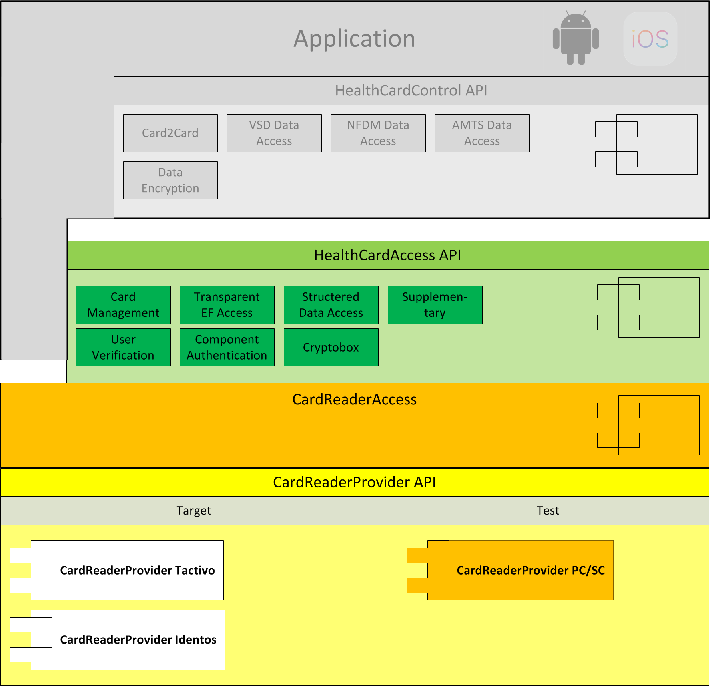
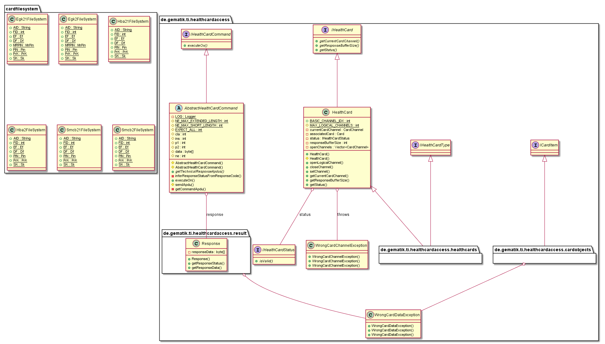
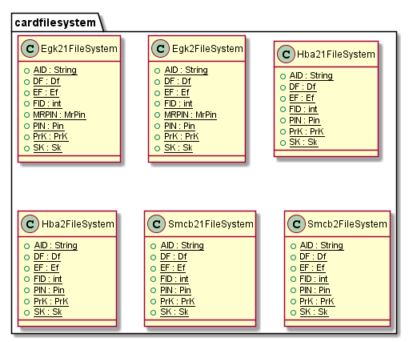
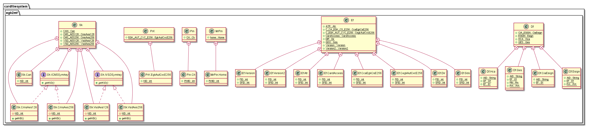
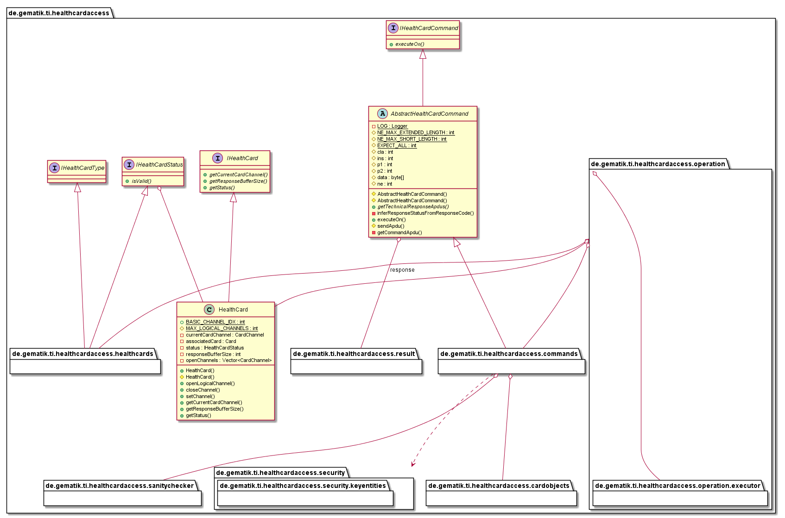
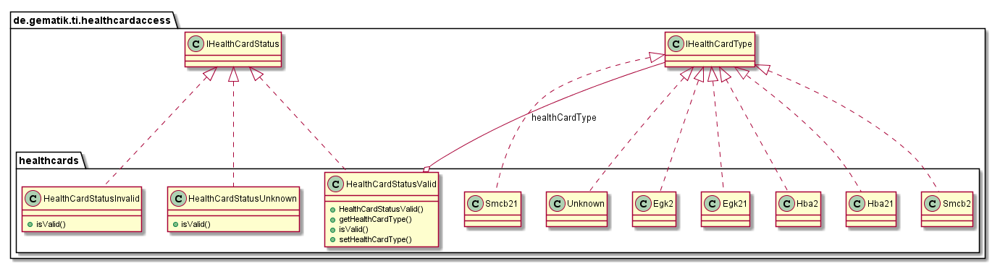
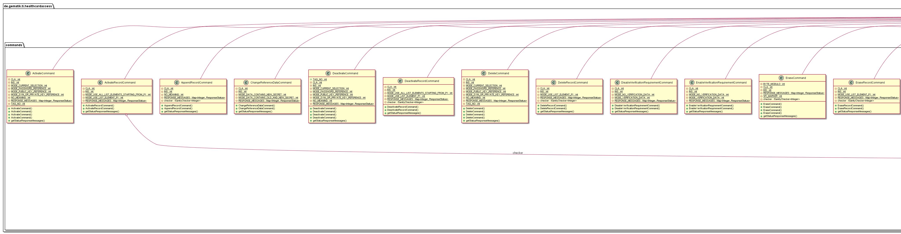
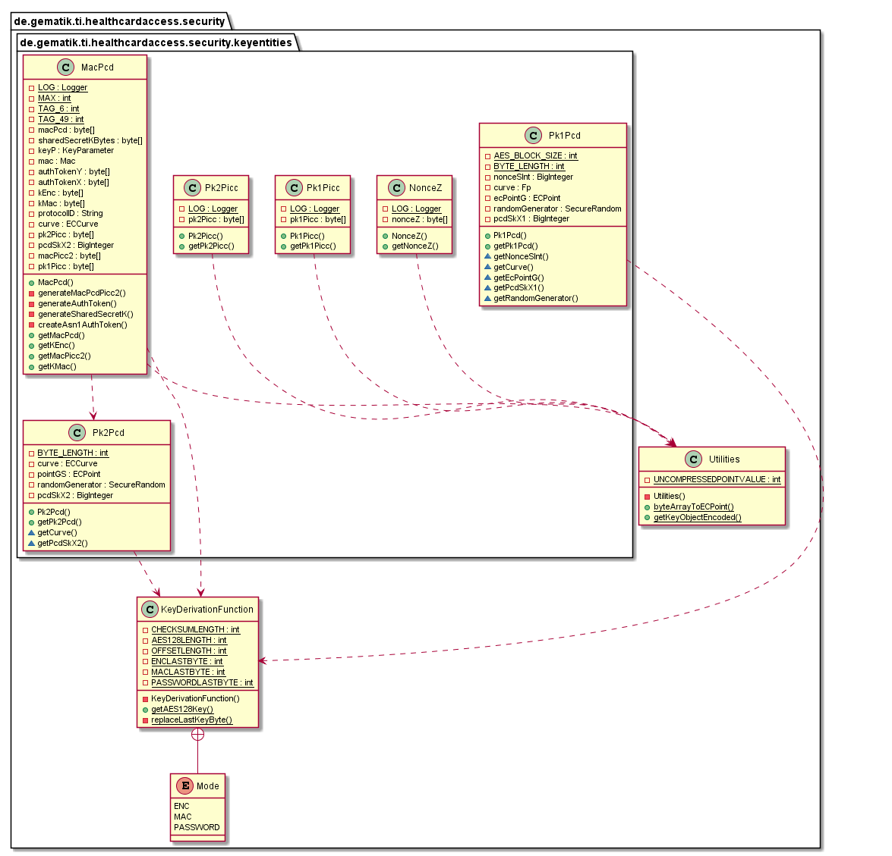

# HealthCardAccess Java Library

## Introduction

This part describes the usage of low level HealthCardAccess API in order to send
smartcard commands to a smartcard connected to card reader.

## API Documentation

Generated API docs are available at <https://gematik.github.io/ref-HealthCardAccess>.

## License

Licensed under the [Apache License, Version 2.0](https://www.apache.org/licenses/LICENSE-2.0).

## Overview

This library contains an package `cardfilesystem` which contains the card structure as classes for each supported health card type.
Furthermore the `de.gematik.ti.healtcardaccess` package and subpackages contains the classes for cards, commands and error handling.

  

### CardFileSystem

The CardFileSystem represents the structure of health cards (EGK, HBA, SMCB, SMCK) and for specific generation (G2, G2.1).

  

The entry object is one of `{TYPE}{GENERATION}FileSystem`. This contains the root structure for each type of card system. From this root point could you select the child’s and so on.
The following picture show exemplary for all FileSystems the complete EGK2 FileSystem structure.

  

### HealthCardAccess API

The HealthCardAccess API Structure contains `healthcards` package with object represents all supported card types, `commands` and `result` package with all supported commands and responses for health cards,
`cardobjects` package with possible object on health cards and `operation` package with functionalities to cascade and execute commands on health cards.

  

#### Health Cards

The health card objects in `healthcards` package represent the potential types of health cards and this type is indirect stored on HealthCard objects with `IHealthCardStatus`.
The implementation of `IHealthCardStatus` could `HealthCardStatusValid` and this stores the health card type.

  

Furthermore contains the `HealthCard` object the physical card from card reader, response buffer and channels.

#### Commands

The `commands` package contains all available commands for health cards.

  

#### Security

The security and sub-package contains the key derivation function and the key entities.

  

## Getting Started

### Create a command

The design of this API follows the [command design pattern](https://en.wikipedia.org/wiki/Command_pattern)
as well as functional programming paradigm comparable to [ReactiveX](http://reactivex.io/).
Thus a command object of appropriate command class for the desired command to be sent has to be created
first. When creating the command it needs to be configured to be configured.

Following example shall send a SELECT command to a smartcard in order to select the folder
(aka Distinguished File = DF) DF.HCA. So we need to to create a SelectCommand object an pass the
FileIdentifier of DF.HCA to the command object.

    AbstractHealthCardCommand hcc = new SelectCommand(Egk.Df.HCA.getAid());

As commands are executed on smartcards, such command object can be executed on a card object.
Next example presumes that we already got an Egk object as one kind of a healthcard. The
result of command execution can be validated against an expected response status,
e.g. SUCCESS response status. In order to test the response status it needs to be
retrieved from the execution response. This is done by mapping `ResultOperation<Response>` to
`ResultOperation<ResponseStatus>` and to test it against the expected `ResponseStatus` by means of
`TestSubscriber` object created by calling `test()` method . This is
shown in next example.

    private Egk hc;
    ...

    ResultOperation<Response> result = hcc.executeOn(hc);
    ResultOperation<Response.ResponseStatus> status = result.map(Response::getResponseStatus);
    TestSubscriber<Response.ResponseStatus> subscriber = status.test();
    subscriber.assertValue(Response.ResponseStatus.SUCCESS);

If command execution returns a different value than SUCCESS as expected in example above, an
`AssertionError` is thrown at the end of command execution.

The example above can be written in a much shorter format by omitting the object references and
chaing the method executions, like shown below.

    private Egk hc;
    ...

    hcc.executeOn(hc)
                    .map(Response::getResponseStatus)
                    .test()
                    .assertValue(Response.ResponseStatus.SUCCESS);

### Build setup

To use HealthCardAccess library in a project, you need just to include following dependency:

**Gradle dependency settings to use healthcard access library.**

    dependencies {
        implementation group: 'de.gematik.ti', name: 'healthcard.access', version: '1.2.1'
    }

**Maven dependency settings to use healthcard access library.**

    <dependencies>
        <dependency>
            <groupId>de.gematik.ti</groupId>
            <artifactId>healthcard.acces</artifactId>
            <version>1.2.1</version>
        </dependency>
    </dependencies>
